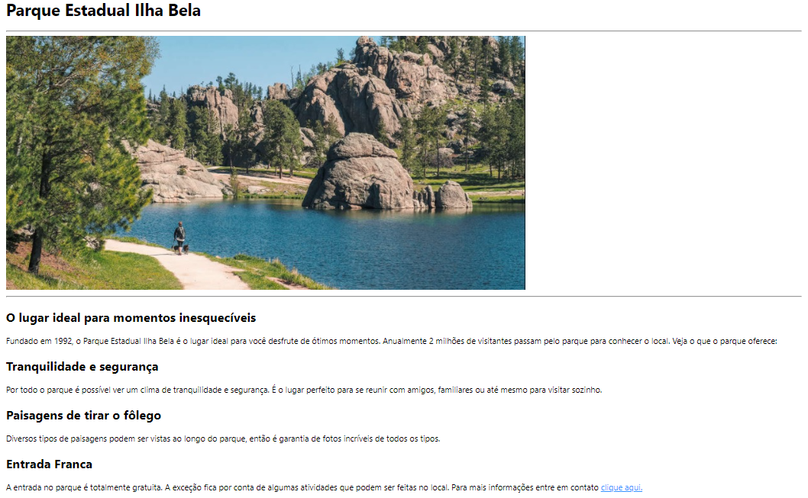

# Front-end
Desenvolvimento do guia para construção de layout.
 

## Parque Estadual Ilha Bela

Página estática em html com seções.

<pre>
Realizador:
° RYAN CASTRO FERREIRA.
<b>LinkedIn</b>- <a href="https://www.linkedin.com/in/ryan-castro-ferreira">https://www.linkedin.com/in/ryan-castro-ferreira/</a>
<b>E-mail</b>- ryancasf@gmail.com
</pre>

<pre>
FONTE: Guia Front-end DevMedia
</pre>
